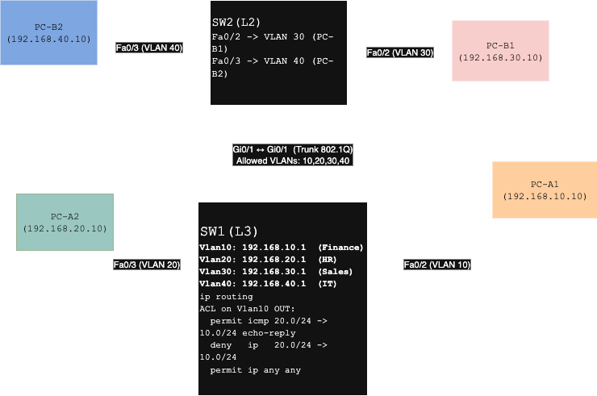

#  Inter-VLAN Routing Lab (Two Switches)

## 📌 Overview
This project demonstrates **inter-VLAN routing with ACL-based traffic control** using:
- **SW1**: Layer-3 switch (routing + ACLs)  
- **SW2**: Layer-2 switch (VLAN access + trunking)  
- **Four VLANs** (Finance, HR, Sales, IT) with host PCs for testing.  

---

## 🔹 Network Topology


---

## 🔹 VLAN & IP Setup
### SW1 (Layer-3 Switch)
- VLAN 10 (Finance) → `192.168.10.1/24`  
- VLAN 20 (HR) → `192.168.20.1/24`  
- VLAN 30 (Sales) → `192.168.30.1/24`  
- VLAN 40 (IT) → `192.168.40.1/24`  
- `ip routing` enabled  

### SW2 (Layer-2 Switch)
- `Fa0/2` → VLAN 30 (Sales, PC-B1)  
- `Fa0/3` → VLAN 40 (IT, PC-B2)  
- `Gi0/1` trunk to SW1 (allowed VLANs: 10,20,30,40)  

### End Devices
- **PC-A1** → VLAN 10 (Finance) → `192.168.10.10/24`  
- **PC-A2** → VLAN 20 (HR) → `192.168.20.10/24`  
- **PC-B1** → VLAN 30 (Sales) → `192.168.30.10/24`  
- **PC-B2** → VLAN 40 (IT) → `192.168.40.10/24`  

---

## 🔹 ACL Policy
Access Control List applied **outbound on Finance (VLAN 10)**:

```cisco
ip access-list extended HR_OUTBOUND
  permit icmp 192.168.20.0 0.0.0.255 192.168.10.0 0.0.0.255 echo-reply
  deny   ip   192.168.20.0 0.0.0.255 192.168.10.0 0.0.0.255
  permit ip any any
!
interface Vlan10
 ip access-group HR_OUTBOUND out
